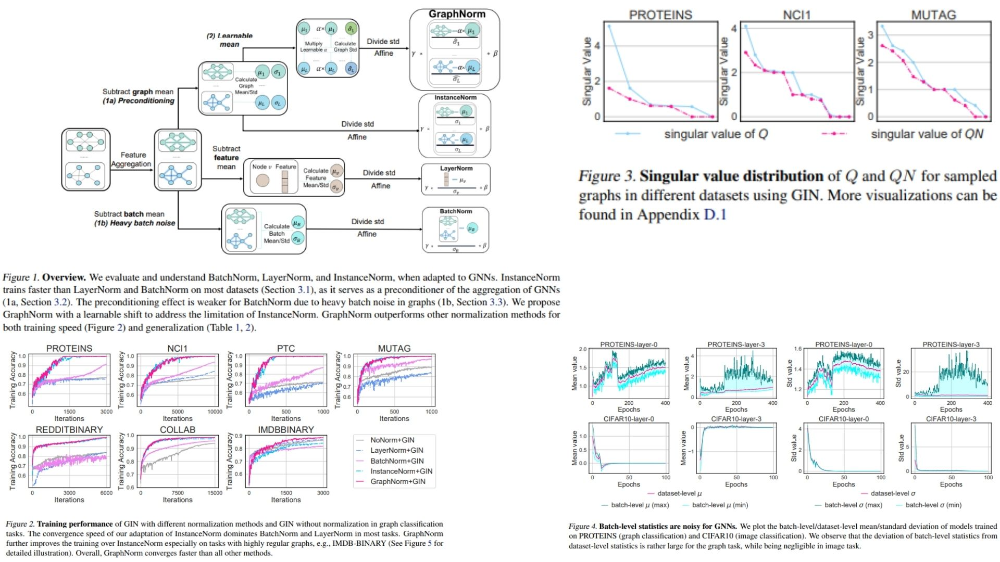

# 🌿 GraphNorm-GNN-Replication — GraphNorm: A Principled Approach to Accelerating
Graph Neural Network Training


This repository provides a **faithful PyTorch replication** of the  
**GraphNorm-GNN** architecture for molecular property prediction.

Focus is on **paper-accurate math, block diagrams, and pipeline**, not benchmarking.  
It implements **graph-aware normalization and aggregation** for GNNs in molecular tasks.

Highlights include:

- Graph convolution layers (GCN / GIN) with **normalized aggregation matrix Q** 🔗  
- GraphNorm normalization for stable node representations 🌱  
- Readout (We don't have it, but the purpose of the linear one is the same) and linear layers for molecule-level predictions 🧪  

Paper reference: [GraphNorm: A Principled Approach to Accelerating
Graph Neural Network Training
](https://arxiv.org/abs/2009.03294)

---

## Overview — GraphNorm Pipeline 🌳



> Node features are normalized considering **graph size and structure**, enhancing message passing stability.

Pipeline:

- **GNN layers:** GCN / GIN aggregations using normalized adjacency Q  
- **GraphNorm / normalization modules** for per-graph scaling and centering  

This produces **graph-stable, normalized embeddings** for downstream tasks.

---

## Graph Representation ⚛️

Molecule as graph:

$$
G = (V, E), \quad V = \{v_1, ..., v_n\}, \quad E = \{(v_i, v_j)\}
$$

Node features:

$$
h_i \in \mathbb{R}^F
$$

Adjacency normalization:

$$
Q = D^{-1/2} A D^{-1/2}
$$

where $D$ is the degree matrix of $A$. This ensures **balanced message passing** regardless of node degrees.

---

## GraphNorm 🔄

GraphNorm normalizes node features per graph:

$$
\tilde{h}_i = \frac{h_i - \alpha \cdot \text{mean}(h)}{\sqrt{\text{var}(h) + \epsilon}} \cdot \gamma + \beta
$$

- $\alpha$, $\gamma$, $\beta$ are learnable parameters  
- Adjusts for **graph size variance** and stabilizes training  

---

## Why GraphNorm Matters 🌟

- Corrects for **graph size variance** in GNNs  
- Improves **training stability** and performance  
- Minimal, readable code replicating paper's math and design  
- Ideal for research, education, and replication  

---

## Repository Structure 🗂

```bash
GraphNorm-GNN-Replication/
├── src/
│   │
│   ├── gnn_layers/
│   │   ├── gcn_layer.py        # Eq.(2) aggregation
│   │   ├── gin_layer.py        # Eq.(3) aggregation
│   │   └── aggregation.py      # adjacency → Q matrisi
│   │
│   ├── normalization/
│   │   └── graphnorm.py        # Paper contribution
│   │
│   ├── model/
│   │   └── gnn_model.py        # Eq.(4) pipeline:
│   │                          # Linear → Q aggregation → Norm → Activation
│   └── config.py
│
├── images/
│   └── figmix.jpg
│
├── requirements.txt
└── README.md
```
---


## 🔗 Feedback

For questions or feedback, contact: [barkin.adiguzel@gmail.com](mailto:barkin.adiguzel@gmail.com)
